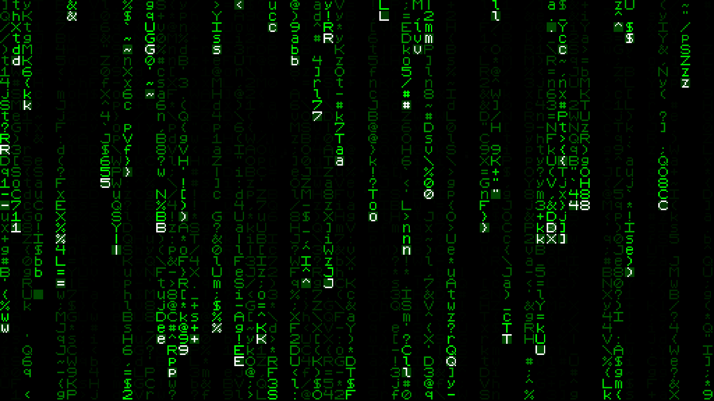

<h1 align="center">Lotrix</h1>

Lo-fi Matrix effect written in C + Raylib. Font made by me.

512x288

## Features
- Arguments:
  - `./lotrix [width] [height] [max_amount] [rainbow] [message]`
- Binds:
  - `KEY_SPACE/KEY_P` - Pause/unpause.
  - `KEY_F` - Toggle fullscreen.
